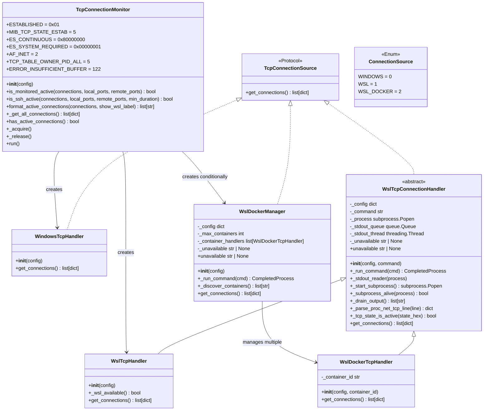

# Class Architecture



## Handler Hierarchy

```
TcpConnectionSource (Protocol)
├── WindowsTcpHandler          — Windows iphlpapi
├── WslTcpConnectionHandler    — abstract base for WSL subprocess
│   ├── WslTcpHandler          — /proc/net/tcp
│   └── WslDockerTcpHandler    — docker exec <container> /proc/net/tcp
└── WslDockerManager           — manages multiple WslDockerTcpHandler instances
```
