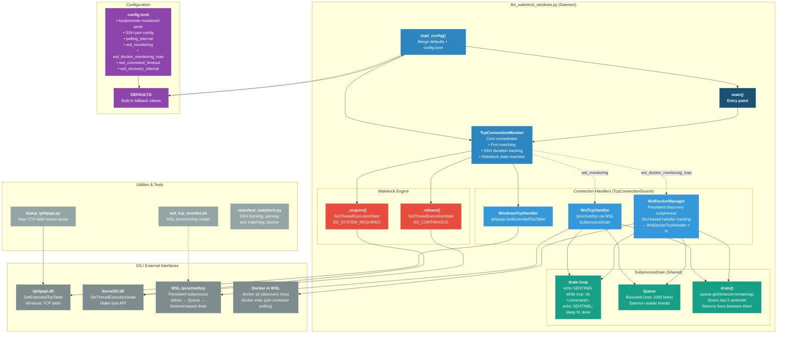
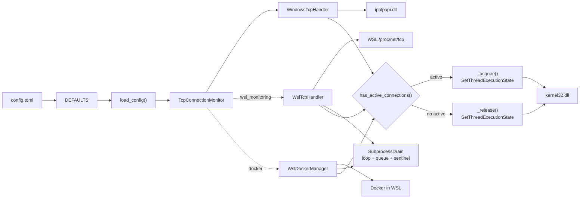

# Component Architecture



## Component Responsibilities

| Component | Layer | Responsibility |
|---|---|---|
| **main()** | Entry | Bootstrap: load config → create monitor → run loop |
| **load_config()** | Configuration | Merge `config.toml` overrides with `DEFAULTS` |
| **TcpConnectionMonitor** | Core | Orchestrates handlers, matches ports, tracks SSH duration, manages wakelock state |
| **WindowsTcpHandler** | Handler | Reads Windows TCP table via `iphlpapi.GetExtendedTcpTable` |
| **WslTcpHandler** | Handler | Reads WSL `/proc/net/tcp` via `SubprocessDrain` (persistent subprocess + queue + sentinel drain) |
| **WslDockerManager** | Handler | Persistent discovery subprocess with sentinel-based iteration; dict-based handler tracking |
| **WslDockerTcpHandler** | Handler | Reads a single container's `/proc/net/tcp` via `docker exec` + `SubprocessDrain` |
| **SubprocessDrain** | Shared | Persistent subprocess lifecycle, bounded queue, daemon reader thread, sentinel-based drain (queue.get with timeout, last-pair scanning) |
| **Wakelock Engine** | OS Interface | Acquires/releases Windows wake lock via `kernel32.SetThreadExecutionState` |
| **dump_iphlpapi.py** | Utility | Dumps raw TCP table buffer for binary analysis |
| **wsl_tcp_monitor.sh** | Utility | WSL helper script for `/proc/net/tcp` monitoring |

## Data Flow



## Handler Interface

All handlers implement `TcpConnectionSource` and return a uniform connection dict:

```python
{
    "state": int,           # TCP state (5 = ESTABLISHED)
    "local_addr": str,      # Local IPv4 address
    "local_port": int,      # Local port number
    "remote_addr": str,     # Remote IPv4 address
    "remote_port": int,     # Remote port number
    "source": ConnectionSource,  # WINDOWS | WSL | WSL_DOCKER
    "container_id": str,    # Docker container short ID (WSL_DOCKER only)
}
```
