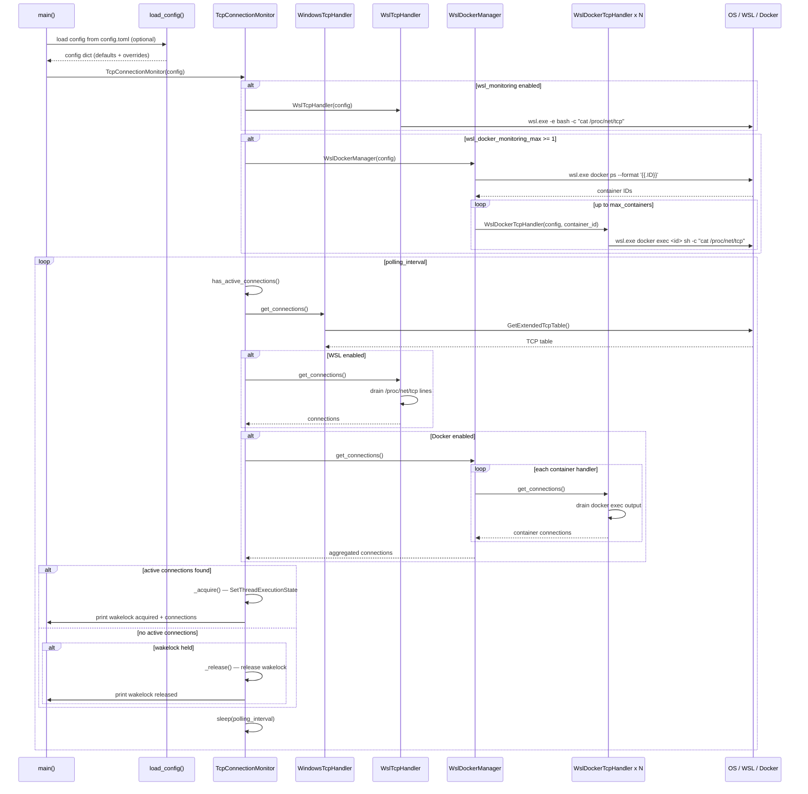
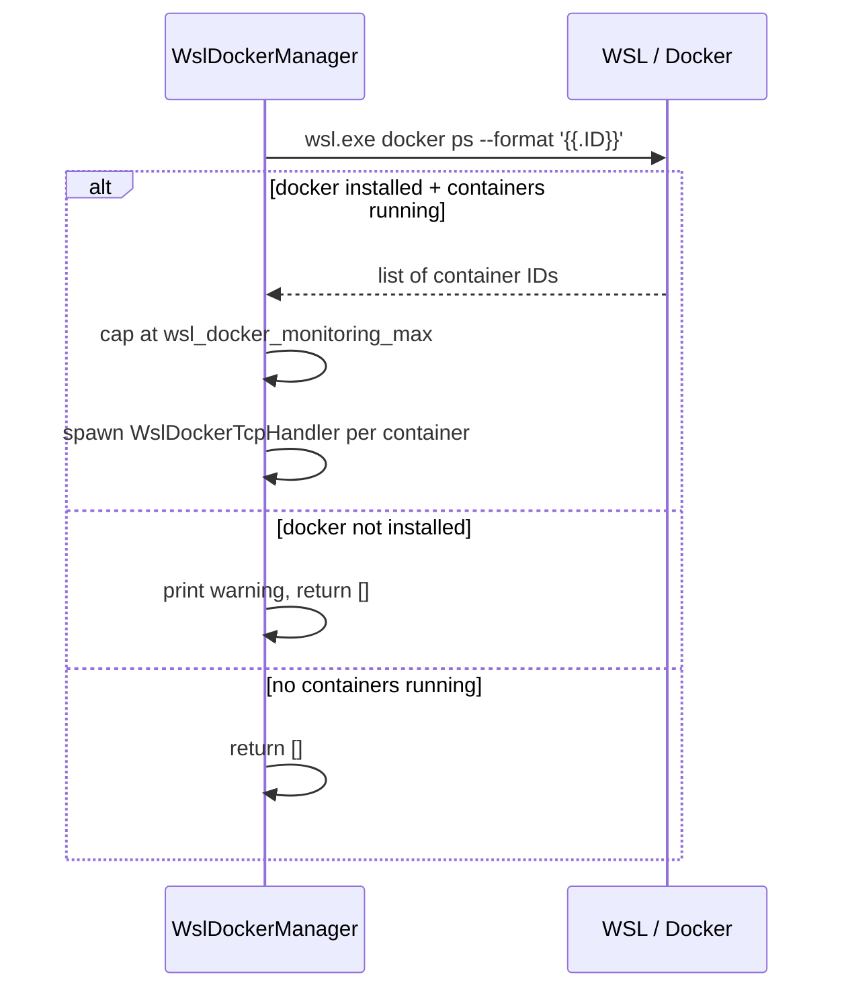
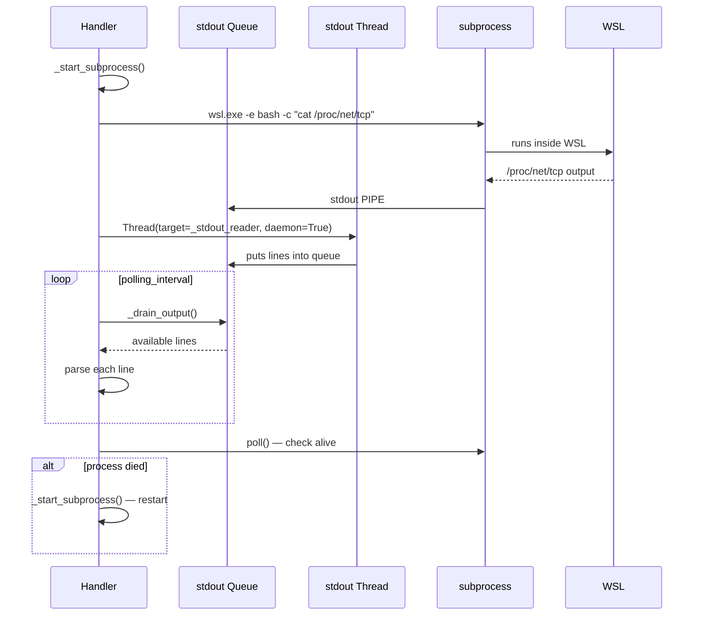

# Execution Flow

## Application Startup & Main Loop

```mermaid
sequenceDiagram
    participant M as main()
    participant LC as load_config()
    participant TC as TcpConnectionMonitor
    participant WH as WindowsTcpHandler
    participant WSH as WslTcpHandler
    participant WD as WslDockerManager
    participant WDC as WslDockerTcpHandler x N
    participant OS as OS / WSL / Docker

    M->>LC: load config from config.toml (optional)
    LC-->>M: config dict (defaults + overrides)
    M->>TC: TcpConnectionMonitor(config)

    alt wsl_monitoring enabled
        TC->>WSH: WslTcpHandler(config)
        WSH->>OS: wsl.exe -e bash -c "cat /proc/net/tcp"
    end

    alt wsl_docker_monitoring_max >= 1
        TC->>WD: WslDockerManager(config)
        WD->>OS: wsl.exe docker ps --format '{{.ID}}'
        OS-->>WD: container IDs
        loop up to max_containers
            WD->>WDC: WslDockerTcpHandler(config, container_id)
            WDC->>OS: wsl.exe docker exec <id> sh -c "cat /proc/net/tcp"
        end
    end

    loop polling_interval
        TC->>TC: has_active_connections()
        TC->>WH: get_connections()
        WH->>OS: GetExtendedTcpTable()
        OS-->>WH: TCP table

        alt WSL enabled
            TC->>WSH: get_connections()
            WSH->>WSH: drain /proc/net/tcp lines
            WSH-->>TC: connections
        end

        alt Docker enabled
            TC->>WD: get_connections()
            loop each container handler
                WD->>WDC: get_connections()
                WDC->>WDC: drain docker exec output
                WDC-->>WD: container connections
            end
            WD-->>TC: aggregated connections
        end

        alt active connections found
            TC->>TC: _acquire() — SetThreadExecutionState
            TC->>M: print wakelock acquired + connections
        else no active connections
            alt wakelock held
                TC->>TC: _release() — release wakelock
                TC->>M: print wakelock released
            end
        end

        TC->>TC: sleep(polling_interval)
    end
```

## Docker Container Discovery

```mermaid
sequenceDiagram
    participant WD as WslDockerManager
    participant OS as WSL / Docker

    WD->>OS: wsl.exe docker ps --format '{{.ID}}'
    alt docker installed + containers running
        OS-->>WD: list of container IDs
        WD->>WD: cap at wsl_docker_monitoring_max
        WD->>WD: spawn WslDockerTcpHandler per container
    else docker not installed
        WD->>WD: print warning, return []
    else no containers running
        WD->>WD: return []
    end
```

## WSL Subprocess Lifecycle

```mermaid
sequenceDiagram
    participant H as Handler
    participant Q as stdout Queue
    participant T as stdout Thread
    participant P as subprocess
    participant OS as WSL

    H->>H: _start_subprocess()
    H->>P: wsl.exe -e bash -c "cat /proc/net/tcp"
    P->>OS: runs inside WSL
    OS-->>P: /proc/net/tcp output
    P->>Q: stdout PIPE
    H->>T: Thread(target=_stdout_reader, daemon=True)
    T->>Q: puts lines into queue
    loop polling_interval
        H->>Q: _drain_output()
        Q-->>H: available lines
        H->>H: parse each line
    end
    H->>P: poll() — check alive
    alt process died
        H->>H: _start_subprocess() — restart
    end
```
