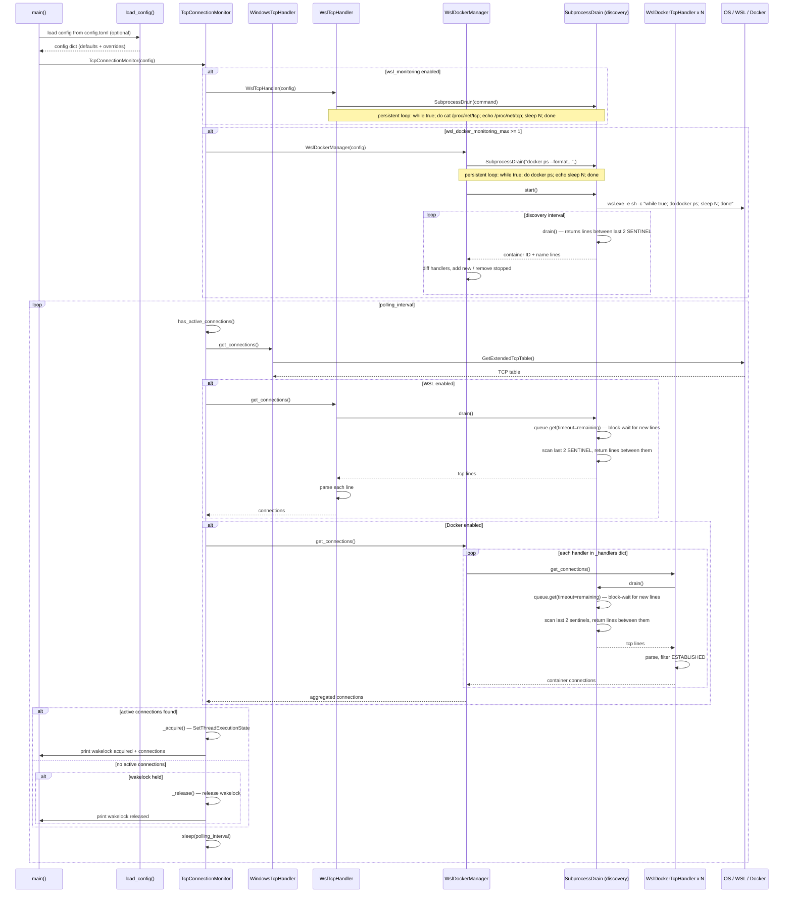
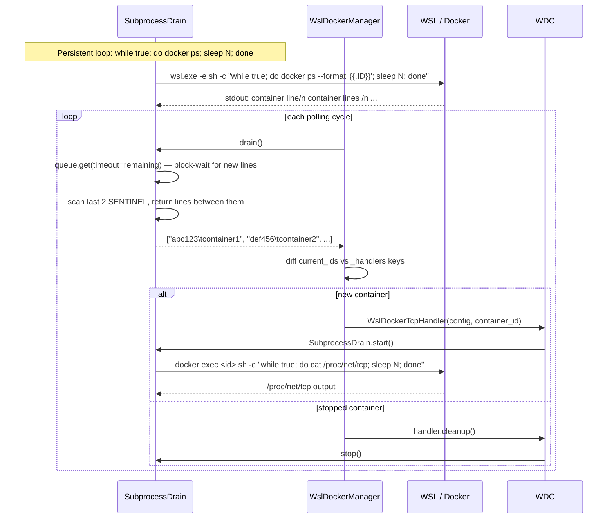
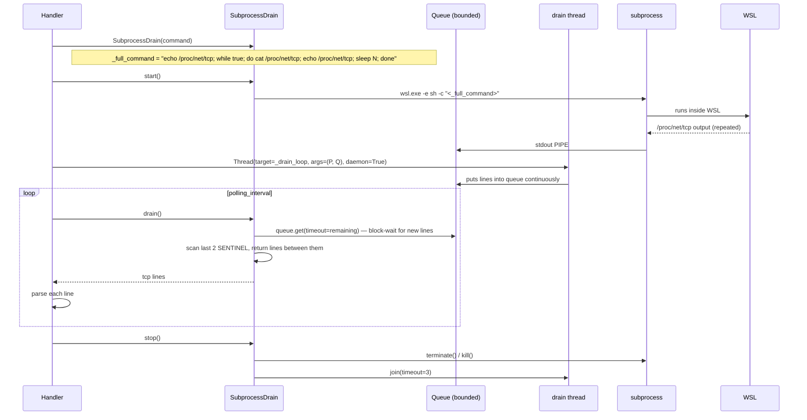

# Execution Flow

## Application Startup & Main Loop

```mermaid
sequenceDiagram
    participant M as main()
    participant LC as load_config()
    participant TC as TcpConnectionMonitor
    participant WH as WindowsTcpHandler
    participant WSH as WslTcpHandler
    participant WD as WslDockerManager
    participant DD as SubprocessDrain (discovery)
    participant WDC as WslDockerTcpHandler x N
    participant OS as OS / WSL / Docker

    M->>LC: load config from config.toml (optional)
    LC-->>M: config dict (defaults + overrides)
    M->>TC: TcpConnectionMonitor(config)

    alt wsl_monitoring enabled
        TC->>WSH: WslTcpHandler(config)
        WSH->>DD: SubprocessDrain(command)
        Note over WSH,DD: persistent loop: while true#59; do cat /proc/net/tcp#59; echo /proc/net/tcp#59; sleep N#59; done
    end

    alt wsl_docker_monitoring_max >= 1
        TC->>WD: WslDockerManager(config)
        WD->>DD: SubprocessDrain("docker ps --format...",)
        Note over WD,DD: persistent loop: while true#59; do docker ps#59; echo sleep N#59; done
        WD->>DD: start()
        DD->>OS: wsl.exe -e sh -c "while true#59; do docker ps#59; sleep N#59; done"
        loop discovery interval
            DD->>DD: drain() — returns lines between last 2 SENTINEL
            DD-->>WD: container ID + name lines
            WD->>WD: diff handlers, add new / remove stopped
        end
    end

    loop polling_interval
        TC->>TC: has_active_connections()
        TC->>WH: get_connections()
        WH->>OS: GetExtendedTcpTable()
        OS-->>WH: TCP table

        alt WSL enabled
            TC->>WSH: get_connections()
            WSH->>DD: drain()
            DD->>DD: queue.get(timeout=remaining) — block-wait for new lines
            DD->>DD: scan last 2 SENTINEL, return lines between them
            DD-->>WSH: tcp lines
            WSH->>WSH: parse each line
            WSH-->>TC: connections
        end

        alt Docker enabled
            TC->>WD: get_connections()
            loop each handler in _handlers dict
                WD->>WDC: get_connections()
                WDC->>DD: drain()
                DD->>DD: queue.get(timeout=remaining) — block-wait for new lines
                DD->>DD: scan last 2 sentinels, return lines between them
                DD-->>WDC: tcp lines
                WDC->>WDC: parse, filter ESTABLISHED
                WDC-->>WD: container connections
            end
            WD-->>TC: aggregated connections
        end

        alt active connections found
            TC->>TC: _acquire() — SetThreadExecutionState
            TC->>M: print wakelock acquired + connections
        else no active connections
            alt wakelock held
                TC->>TC: _release() — release wakelock
                TC->>M: print wakelock released
            end
        end

        TC->>TC: sleep(polling_interval)
    end
```

## Docker Container Discovery (Persistent Subprocess)

```mermaid
sequenceDiagram
    participant DD as SubprocessDrain
    participant WD as WslDockerManager
    participant OS as WSL / Docker

    Note over DD: Persistent loop: while true#59; do docker ps#59; sleep N#59; done
    DD->>OS: wsl.exe -e sh -c "while true#59; do docker ps --format '{{.ID}}'#59; sleep N#59; done"
    OS-->>DD: stdout: container line/n container lines /n ...

    loop each polling cycle
        WD->>DD: drain()
        DD->>DD: queue.get(timeout=remaining) — block-wait for new lines
        DD->>DD: scan last 2 SENTINEL, return lines between them
        DD-->>WD: ["abc123\tcontainer1", "def456\tcontainer2", ...]
        WD->>WD: diff current_ids vs _handlers keys
        alt new container
            WD->>WDC: WslDockerTcpHandler(config, container_id)
            WDC->>DD: SubprocessDrain.start()
            DD->>OS: docker exec <id> sh -c "while true#59; do cat /proc/net/tcp#59; sleep N#59; done"
            OS-->>DD: /proc/net/tcp output
        else stopped container
            WD->>WDC: handler.cleanup()
            WDC->>DD: stop()
        end
    end
```

## WSL Subprocess Lifecycle (via SubprocessDrain)

```mermaid
sequenceDiagram
    participant H as Handler
    participant DD as SubprocessDrain
    participant Q as Queue (bounded)
    participant T as drain thread
    participant P as subprocess
    participant OS as WSL

    H->>DD: SubprocessDrain(command)
    Note over DD: _full_command = "echo /proc/net/tcp#59; while true#59; do cat /proc/net/tcp#59; echo /proc/net/tcp#59; sleep N#59; done"

    H->>DD: start()
    DD->>P: wsl.exe -e sh -c "<_full_command>"
    P->>OS: runs inside WSL
    OS-->>P: /proc/net/tcp output (repeated)
    P->>Q: stdout PIPE
    H->>T: Thread(target=_drain_loop, args=(P, Q), daemon=True)
    T->>Q: puts lines into queue continuously

    loop polling_interval
        H->>DD: drain()
        DD->>Q: queue.get(timeout=remaining) — block-wait for new lines
        DD->>DD: scan last 2 SENTINEL, return lines between them
        DD-->>H: tcp lines
        H->>H: parse each line
    end

    H->>DD: stop()
    DD->>P: terminate() / kill()
    DD->>T: join(timeout=3)
```
